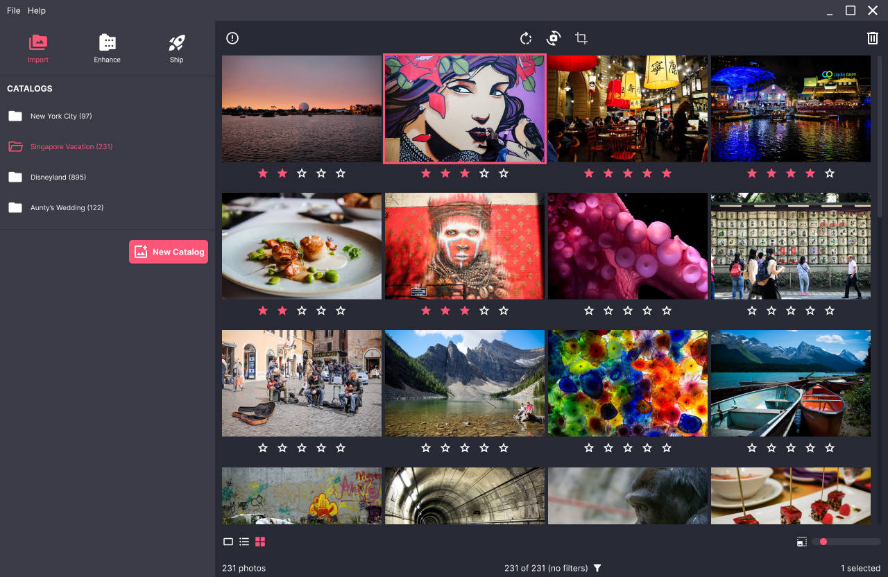

# Overview
A lightweight, non-destructive photo editing software designed for photographers and photography workflows. As a casual photographer, the commercial tools are excellent, but too expensive for processing only a few photos monthly. On the other hand, open source alternatives are not as refined and not very intuitive to use. 

So I created my own photography workflow tool that replicates the workflow and UI/UX of commercial tools.

# Features
1. **Catalogs**: Organize photos by importing files from various folders to create catalogs. Quickly rate, tag, label, cull, rotate, and crop photos using keyboard shortcuts. Filter and find your photos using EXIF and other metadata.
2. **Enhance**: Achieve unique looks using various looks, lens filters, and custom perform adjustments. Compare before/after to achieve that perfect look.
3. **Process**: Bulk process developed photos with additional tools to resize, rename, watermark, adjust quality, and change image file type.

## Free Features
1. Import unlimited photos and catalogs.
2. Apply unlimited enhancements ("looks") to your photos.
3. Export up to 100 photos per month, which resets on the 1st day of each month.

## Paid Features
Purchase credits to unlock paid features. Credits increase the limit on how many photos you can export. Importing and applying enhancements will still remain unlimited so that you can play with your photos and only export the photos that have the most meaning to you.
1. Unlimited photos and enhancements from the free tier.
2. Additional advanced library of looks for more creative styling of your photos.
3. Fine tune images using colour grading sliders: Exposure, Contrast, Highlights, Shadows, Temperature, Tone, Hue, Saturation, etc.

## Future Features
1. Cloud storage.
2. Social platform.
3. Stock photo marketplace.

# Screenshots

# Minimum Requirements
Built using cross-platform technology, the following operating systems are supported:
* Microsoft Windows
* Apple MacOS
* Linux
